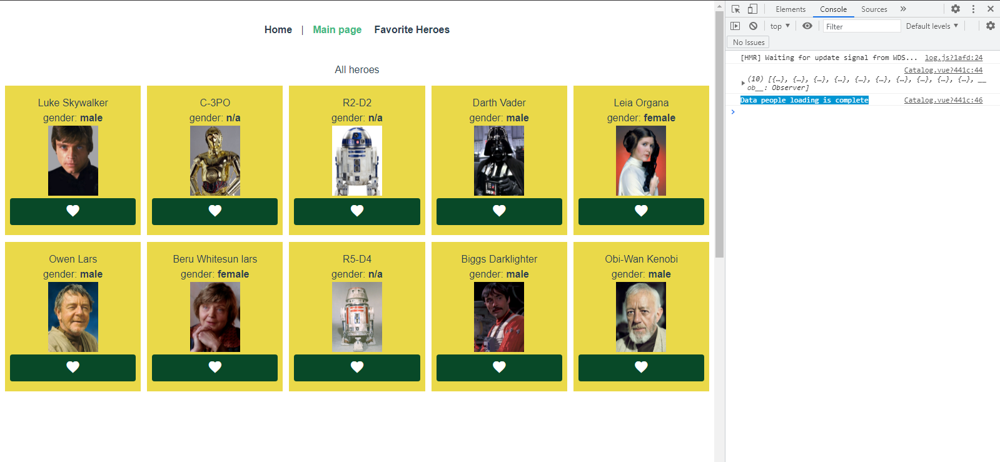

# crypton



## Project setup

```text
yarn install
```

### Compiles and hot-reloads for development

```text
yarn serve
```

### Compiles and minifies for production

```text
yarn build
```

### Lints and fixes files

```text
yarn lint
```

### Customize configuration

See [Configuration Reference](https://cli.vuejs.org/config/).

