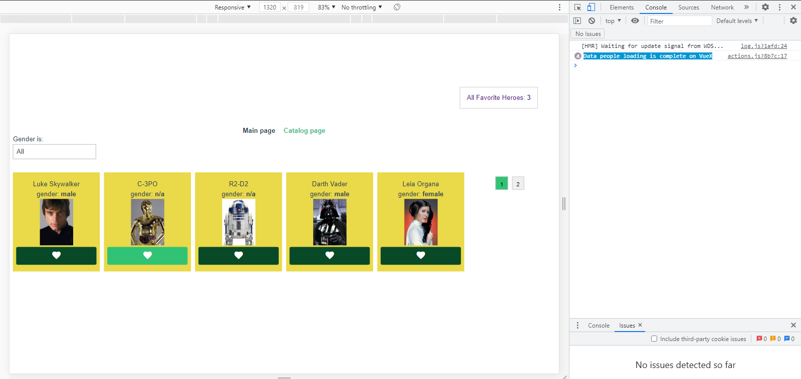

# crypton

### Details

* images to people from [https://starwars-visualguide.com/\#/](https://starwars-visualguide.com/#/)
* example image link [https://starwars-visualguide.com/assets/img/characters/1.jpg](https://starwars-visualguide.com/assets/img/characters/1.jpg)
* search
* adding favorite heroes
* localStorage
* pagination



## Project setup

```text
yarn install
```

### Compiles and hot-reloads for development

```text
yarn serve
```

### Compiles and minifies for production

```text
yarn build
```

### Lints and fixes files

```text
yarn lint
```

### Customize configuration

See [Configuration Reference](https://cli.vuejs.org/config/).

